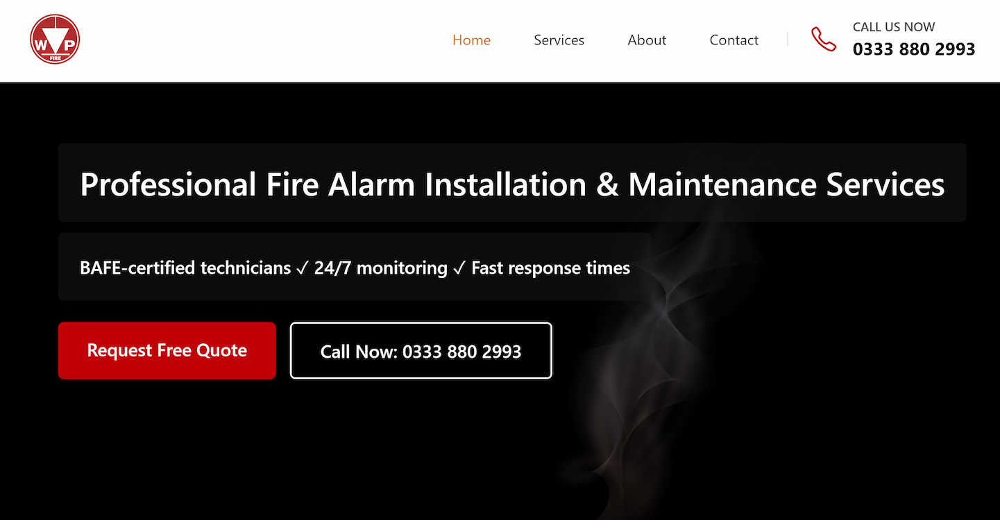

# WP Fire – Next.js 15 + Three.js Client Project

**Live Demo:** [https://www.wpfire.co.uk](https://www.wpfire.co.uk)

A complete production single-page website built for a BAFE-certified fire safety company.

This was my **first commercial Next.js project**, created to deliver a fast, minimal, high-converting landing page while incorporating a subtle Three.js canvas in the hero for depth and modern feel.

### Lighthouse Scores (Feb 2026)

| Device      | Performance | Accessibility | Best Practices | SEO     |
| ----------- | ----------- | ------------- | -------------- | ------- |
| **Mobile**  | **98**      | **100**       | **100**        | **100** |
| **Desktop** | **100**     | **100**       | **100**        | **100** |

### Three.js Canvas Integration (Key Showcase)

- Subtle animated smoke/fire effect in the hero section using Three.js v0.183
- Zero impact on performance (still 98 mobile Lighthouse)
- Clean integration with Next.js 15 App Router + React 19
- Demonstrates early capability for immersive hero elements, product visualisers, and minimal 3D experiences

Currently expanding my Three.js skills (react-three-fiber, shaders, glTF, post-processing) and actively looking for agency collaborations.

### Tech Stack

- Next.js 15.5 (App Router) + React 19
- Tailwind CSS 4
- Three.js + canvas integration
- Secure server-side contact form (SendGrid + spam protection)
- Full JSON-LD schema, sitemap, OG images
- WCAG AA accessible + perfect Lighthouse

### Perfect For Agencies

Clean, well-commented codebase ready for client handoff. Ideal for:

- Fast-loading minimal landing pages
- Subtle 3D/immersive hero sections
- Portfolio upgrades with Three.js
- High-performance Next.js projects

**Open for freelance / subcontracting / collaboration** on Three.js, creative React, or Next.js work.

Get in touch: [@peterridingdev](https://x.com/peterridingdev) or via the contact form on the live site.

⭐ Star if you're an agency or dev working with Next.js + Three.js!
